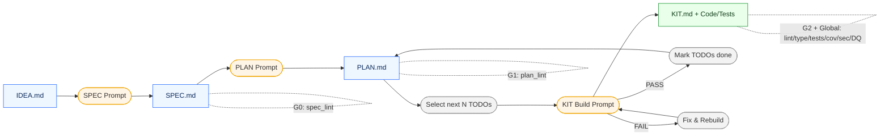

# CLike — Eval‑Driven Harper Workflow Reference
*Version:* 0.1 · *Date:* 2025-09-14

This document is the authoritative reference for the **Eval‑Driven Harper workflow** in CLike.  
It defines **actors, roles, artifacts, prompts, gates, routing, RAG**, and **consequences** from **IDEA → SPEC → PLAN → KIT** until delivery.

---

## 1) Purpose & Principles

- **Outcome over code.** Every step is short, testable, and traceable.
- **Eval‑Driven Development (EDD).** Each transition has **phase gates**; each build has **global gates** (lint, type, tests, coverage, security, data‑quality).
- **Separation of concerns.**  
  SPEC ≠ design · PLAN ≠ code · KIT = implementation + validation.
- **AI‑native orchestration.** Multi‑model, RAG‑grounded, with history scoping and audit trail.
- **Human‑in‑control.** The Developer/Engineer acts as **Orchestrator & Validator**.

---

## 2) Actors & Roles

| Actor | Role | Key Responsibilities |
|---|---|---|
| **Human Orchestrator** (Product Engineer) | Strategy & validation | Approves SPEC, curates PLAN, selects TODO batches, signs off KIT; tunes thresholds; manages exceptions. |
| **VS Code Extension** | UX entrypoint | Conversational “bot” + minimal commands; shows diffs, runs, gate badges. |
| **Orchestrator Service** (FastAPI) | Control plane | Injects phase prompts, manages routing & history scope, triggers gates, persists runs (`runs/<id>`). |
| **Gateway** | Model IO | Uniform API to multiple models (Claude/GPT/local), applies redaction, headers, retries. |
| **LLMs** (multi‑provider) | Generative agents | Obey phase playbooks; do not cross phase boundaries. |
| **RAG Index** | Grounding | Provides scoped context (docs/spec/api) per phase. |
| **CI/CD** | Enforcement | Runs global/phase gates on PR; blocks merge when failing. |
| **Governance (TRiSM)** | Safety & audit | Secrets handling, policy, logging, reproducibility, compliance. |

---

## 3) Artifacts & Structure

```
IDEA.md            # optional high-level idea that feeds SPEC
SPEC.md            # scope, constraints, metrics (no code)
PLAN.md            # backlog of TODOs (≤ 2h) with priority/deps/status
KIT.md             # deliverables + how to run/test/validate/rollout
docs/playbooks/*   # playbooks + prompts per phase
configs/models.yaml# routing profiles
eval/              # gates (global + phase), thresholds, scripts
runs/<ts>-<slug>/  # manifest.json, diffs/, artifacts/, logs/
```

**Prompts per phase** live in `docs/playbooks/prompts/` and are injected by the Orchestrator Service.

---

## 4) Phases, Gates, and Consequences

### Legend
- **Phase Gates** (deterministic, Markdown discipline): G0, G1, G2.
- **Global Gates** (code quality/safety): Lint/Type/Tests/Coverage/Security/Data‑Quality.

### 4.1 IDEA → SPEC (G0)
**Inputs:** `IDEA.md` (optional) · org constraints.  
**Prompt:** `SPEC_WRITE.md` (no code; business intent + constraints + metrics).  
**Document:** `SPEC.md`.

**Phase Gate G0 (spec_lint):**
- Required headings present; sections non‑empty.
- No fenced code blocks.
- Constraints mention **Budget/Timeline/Compliance/Strategic** at least once.
- Success metrics are **quantifiable** (numbers, %, KPI, SLA).
- Light alignment with `IDEA.md` (keyword overlap).

**Global Gates:** _none mandatory_ at this phase.

**Consequence:**
- **PASS** → proceed to PLAN.
- **FAIL** → model proposes SPEC fixes; re‑run G0.

---

### 4.2 SPEC → PLAN (G1)
**Inputs:** `SPEC.md`.  
**Prompt:** `PLAN_WRITE.md` (backlog ≤ 2h, P1/P2/P3, deps).  
**Document:** `PLAN.md` (markdown table).

**Phase Gate G1 (plan_lint):**
- Table found; IDs unique.
- `Priority ∈ {{P1,P2,P3}}` ; `Status ∈ {{pending,in_progress,done}}`.
- Dependencies reference existing IDs; **no cycles**.
- Non‑Goals from SPEC do **not** leak into task descriptions.

**Global Gates:** _none mandatory_ yet.

**Consequence:**
- **PASS** → orchestrator selects next N TODOs.
- **FAIL** → regenerate/repair PLAN; re‑run G1.

---

### 4.3 PLAN → KIT (iterative) (G2 + Global)
**Inputs:** `SPEC.md`, `PLAN.md` (selected TODOs).  
**Prompt:** `KIT_BUILD.md` (generate code/tests/docs) + `KIT_VERIFY.md`.  
**Documents/Artifacts:** `KIT.md`, `src/`, `tests/`, `README.md`, `requirements.txt`.

**Phase Gate G2 (kit_lint):**
- Required sections in `KIT.md`: *Deliverables*, *How to Run*, *How to Test & Validate*.
- Presence of `src/`, `tests/`, `requirements.txt` (when repo is scaffolded).

**Global Gates (EDD):**
- **Ruff** errors ≤ threshold.
- **mypy** errors ≤ threshold.
- **pytest** failures = 0; **coverage ≥ threshold**.
- **Bandit** high severity = 0.
- **(Optional DQ)** schema/null‑ratio within thresholds.

**Consequence per iteration:**
- **PASS** → mark TODOs `done`, commit diffs to `runs/<id>`, select next N.
- **FAIL** → auto‑fix where possible (formatter, trivial patches), else loop with focused prompts; do **not** advance status.

**Exit condition:** All P1/P2 in scope are `done` **and** Global Gates **PASS** on the final build.

---

## 5) Routing, History Scope & Redaction

### 5.1 Model Profiles (`configs/models.yaml`)
Examples:
```yaml
profiles:
  plan.fast:    {{ provider: openai,   model: gpt-4o-mini,    temperature: 0.2, tags: [fast] }}
  code.strict:  {{ provider: openai,   model: gpt-5-thinking, temperature: 0.1, tags: [frontier,quality] }}
  chat.cheap:   {{ provider: anthropic, model: claude-3.7-haiku, temperature: 0.4, tags: [cheap] }}
  local.codegen:{{ provider: ollama,   model: codellama:13b,  temperature: 0.2, tags: [local] }}
```

**Env toggles** honored by the router:
- `PREFER_LOCAL_FOR_CODEGEN`
- `PREFER_FRONTIER_FOR_REASONING`
- `NEVER_SEND_SOURCE_TO_CLOUD` (enables content redaction)
- `OPTIMIZE_FOR=capability|latency|cost|quality`

### 5.2 History Scope per Phase
- **SPEC:** include `IDEA.md` (optional) + `SPEC.md`.
- **PLAN:** include `SPEC.md` + current `PLAN.md`.
- **KIT:** include `SPEC.md` + selected `PLAN.md` rows + `KIT.md`.

### 5.3 Redaction
If `NEVER_SEND_SOURCE_TO_CLOUD=true` and selected profile is cloud, the gateway must **avoid raw source payloads**: send summaries, diffs, or non‑sensitive snippets only.

---

## 6) RAG Usage

- **SPEC:** prior business memos, KPIs, policy docs.
- **PLAN:** SPEC, architecture guidelines, coding standards.
- **KIT:** SPEC, selected PLAN tasks, API schemas, style guides.
Keep RAG **small and relevant**; prefer semantic chunks; log what was retrieved.

---

## 7) Runs, Audit & Reproducibility

Each operation creates `runs/<ts>-<slug>/` with:
- `manifest.json` — phase, model profile, env toggles, prompts, hashes of modified files.
- `diffs/` — patches applied.
- `artifacts/` — generated files/zips.
- `logs/` — stdout/stderr, retrieval traces.

**Session management:**
- `singleModel` clear → drop state for the active model.
- `allModels` clear → drop all model states.
Documents (`SPEC.md`, `PLAN.md`, `KIT.md`) remain the **ground truth**.

---

## 8) Metrics, Thresholds & Tuning

- Start permissive (e.g., `coverage_min: 0.0`) to integrate gates.
- Raise thresholds by domain: *enterprise* (security first), *consumer* (latency & UX), *integration/data* (DQ & contracts).
- Track token/cost/latency per profile; adjust `OPTIMIZE_FOR` and profiles accordingly.

---

## 9) Responsibilities (RACI)

| Activity | Orchestrator | Orchestrator Service | LLMs | CI/CD | Governance |
|---|---|---|---|---|---|
| Define SPEC | **R** | C | C | I | C |
| Approve SPEC | **A** | I | I | I | C |
| Generate PLAN | **R** | C | **C** | I | I |
| Approve PLAN | **A** | I | I | I | I |
| Build KIT (N TODOs) | **R** | C | **C** | I | I |
| Run Gates | **R** | **C** | I | **C** | C |
| Sign‑off Release | **A** | I | I | I | **C** |

R=Responsible, A=Accountable, C=Consulted, I=Informed.

---

## 10) Failure Modes & Recovery

- **G0 fails** (SPEC incomplete): regenerate SPEC with targeted prompts; Orchestrator clarifies constraints/metrics.
- **G1 fails** (PLAN invalid): fix table structure, priorities, or dependency cycles.
- **G2 fails** (KIT scaffold missing): add sections/paths; ensure `src/`, `tests/`, `requirements.txt` exist.
- **Global gates fail:** run autofix (formatter), implement missing tests, fix types or security findings; re‑run.
- **Routing conflicts / redaction:** switch to `local.codegen` or adjust `NEVER_SEND_SOURCE_TO_CLOUD` + summaries.

---

## 11) End‑to‑End Flow (Mermaid)


---

## 12) Appendices

### A) API Surface (Orchestrator)
- `POST /spec` → generate/update SPEC; run **G0**; persist run.
- `POST /plan` → generate/update PLAN; run **G1**; persist run.
- `POST /kit` → scaffold/update KIT; run **G2**; persist run.
- `POST /build-next` → implement next N TODOs; run **Global Gates**; persist run.
- `POST /session/clear` → clear `singleModel|allModels` state.
- `GET /runs/{id}` → get manifest + artifacts metadata.

### B) VS Code Commands
- **Bot** (single entry): understands “new SPEC”, “generate PLAN”, “build next 3”.  
- Palette: `New SPEC`, `Generate PLAN`, `Build Next TODOs`, `Generate KIT`, `Open Run Dashboard`, `Clear Session (single|all)`.
- Testing view shows latest **gate PASS/FAIL** badge.

### C) Domain EVAL Packs
- **Enterprise**: Bandit HIGH=0, audit log hooks, perf regression ≤ X%.
- **Consumer**: latency budget p95, i18n keys presence, content safety stubs.
- **Integration/Data**: schema & null‑ratio gates via DQ script.

---

*End of document.*
