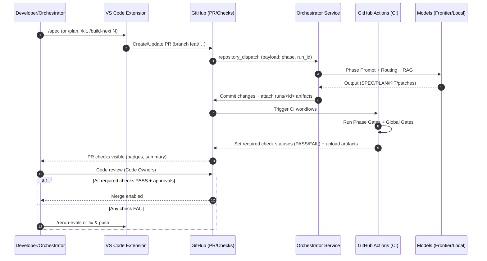

# CLike — Eval-Driven Harper Workflow Reference (GitHub Governance Edition)
*Version:* 0.2.1 · *Date:* 2025-09-15

This document is the authoritative reference for the **Eval-Driven Harper workflow** in CLike, with **GitHub as the governance backbone**.  
It defines **actors, roles, artifacts, prompts, gates, routing, RAG**, and **consequences** from **IDEA → SPEC → PLAN → KIT** until release, and it explains **how GitHub (PRs, Checks, CODEOWNERS, Branch Protection, Actions)** enforces the process.

---

## 0) How to use this document
- Keep this file under version control in `docs/`.
- Treat it as the **single source of truth** for process & governance.
- PRs that change this document should be reviewed by **Code Owners**.

---

## 1) Purpose & Principles

- **Outcome over code.** Every step is short, testable, and traceable.
- **Eval-Driven Development (EDD).** Each transition has **phase gates**; each build has **global gates** (lint, type, tests, coverage, security, data-quality).
- **Separation of concerns.**  
  SPEC ≠ design · PLAN ≠ code · KIT = implementation + validation.
- **AI-native orchestration.** Multi-model, RAG-grounded, with history scoping and audit trail.
- **GitHub as mediation governance too.** Branch protection + required checks + CODEOWNERS + Actions = **governed progress**.
- **Human-in-control.** The Developer/Engineer acts as **Orchestrator & Validator** with final authority at gates.

---

## 2) Actors & Roles (with GitHub responsibilities)

| Actor | Role | GitHub Responsibilities |
|---|---|---|
| **Human Orchestrator** (Product Engineer) | Strategy & validation | Creates/curates SPEC/PLAN; selects TODO batches; triggers builds; reviews PRs; approves when gates PASS. |
| **Repo Maintainer** | Admin & policy | Sets branch protection; defines required checks; manages environments & approvals; owns release tags. |
| **Code Owner(s)** | Quality ownership | Must review PRs per `CODEOWNERS`; can **block/approve** merges; maintains thresholds & rubrics. |
| **VS Code Extension** | UX entrypoint | Initiates actions via a GitHub App or CLI; posts comments, status badges, and artifacts links. |
| **Orchestrator Service** (FastAPI) | Control plane | Injects prompts; manages routing & history scope; triggers workflows via `workflow_dispatch`; uploads artifacts. |
| **Gateway** | Model IO | Calls providers (frontier/local), applies redaction, retries; reports usage metrics back to PR checks. |
| **LLMs** (multi-provider) | Generative agents | Obey phase playbooks; do not cross phase boundaries. |
| **GitHub Actions** | Enforcement as Governance | Runs global/phase gates on PR; sets **required checks**; blocks merge when failing. |
| **RAG Index** | Grounding | Supplies scoped context; retrieval traces are uploaded as artifacts. |
| **Governance (TRiSM/Security)** | Safety & audit | Secrets handling, policy, logging, reproducibility, compliance, vulnerability alerts. |

---

## 3) GitHub as Governance Backbone

**Branch Protection**
- `main` is protected; only **PR merges** allowed.
- Required checks (examples): `phase-gates`, `edd-gates`, `lint`, `mypy`, `tests`, `coverage`, `bandit`, `dq`.
- Require **Code Owner review** and **linear history**; block force pushes.

**CODEOWNERS**
- Assign critical paths (e.g., `src/**`, `docs/playbooks/**`, `eval/**`) to domain owners.
- Owners must **approve** to merge.

**PR Templates & Labels**
- PR template requires: **Scope**, **SPEC ref**, **PLAN TODOs**, **Gates summary**, **Risk**.
- Labels: `phase/spec`, `phase/plan`, `phase/kit`, `eval/pass`, `eval/fail`, `security`, `breaking-change`.

**GitHub Actions (CI)**
- Workflows triggered on `pull_request` and `workflow_dispatch`.
- Upload **artifacts**: `eval/out/*`, `runs/<id>/manifest.json`, diffs, and logs.
- Publish a **Job Summary** (markdown) with gate results and next steps.

**Environments & Approvals**
- Protected **staging** and **production** environments with **required reviewers** and **secrets** scoping.
- Manual approval gates before deployment.

**Security & Insights**
- Dependabot alerts; optional CodeQL.
- Audit logs: enable repository-level logging if available; store `runs/` metadata as build artifacts.

---

## 4) GitOps & Commands

**Conventional Commits**
- `feat(playbook): ...`, `fix(router): ...`, `chore(eval): ...`, `docs(governance): ...`.

**`gh` CLI examples**
```bash
gh issue create -t "SPEC: Industry X Observability" -b "Link to IDEA.md ..."
gh pr create -t "PLAN for SPEC #42" -b "Includes PLAN.md with backlog" -B main -H feat/harper-sprintA
gh pr view --web
```

**Slash commands (via GitHub App or Action)**
- `/spec` — generate/update `SPEC.md` (runs **G0**).
- `/plan` — generate/update `PLAN.md` (runs **G1**).
- `/kit` — scaffold/update `KIT.md` (runs **G2**).
- `/build-next 3` — implement next 3 TODOs (runs **Global Gates**).
- `/rerun-evals` — re-run all gates on the PR head.
- `/clear-session allModels` — clear LLM sessions.

> These commands map to Orchestrator endpoints and dispatch the CI with context (run ID, model profile, toggles).

---

## 5) Artifacts & Layout

```
IDEA.md            # optional high-level idea that feeds SPEC
SPEC.md            # scope, constraints, metrics (no code)
PLAN.md            # backlog (≤ 2h) with priority/deps/status
KIT.md             # deliverables + run/test/validate/rollout
docs/playbooks/*   # playbooks + prompts
configs/models.yaml# routing profiles
eval/              # global + phase gates (scripts & thresholds)
.github/           # workflows, CODEOWNERS, templates
runs/<ts>-<slug>/  # manifest.json, diffs/, artifacts/, logs/
```

---

## 6) Phases, Gates, and GitHub Consequences

### 6.1 IDEA → SPEC (G0)
- **Prompt:** `SPEC_WRITE.md` (no code).
- **Gate:** `spec_lint.py` checks headings, quantifiable metrics, constraints, no code, IDEA alignment.
- **GitHub consequence:** PR status `phase-gates: G0` **must PASS**; else label `eval/fail` is applied and merge is blocked.

### 6.2 SPEC → PLAN (G1)
- **Prompt:** `PLAN_WRITE.md`.
- **Gate:** `plan_lint.py` checks table, unique IDs, P1/2/3, valid/acyclic deps, no Non-Goals leakage.
- **GitHub consequence:** PR status `phase-gates: G1` **must PASS** to proceed.

### 6.3 PLAN → KIT (iterative) (G2 + Global)
- **Prompts:** `KIT_BUILD.md` + `KIT_VERIFY.md`.
- **Phase Gate:** `kit_lint.py` requires KIT sections + minimal scaffold.
- **Global Gates:** ruff/mypy/tests/coverage/bandit/DQ according to thresholds.
- **GitHub consequence:** All **required checks** must PASS (Actions set status); Code Owner review then merges.

---

## 7) Routing, History Scope & Redaction

Profiles (`configs/models.yaml`) + env toggles:
- `PREFER_LOCAL_FOR_CODEGEN`, `PREFER_FRONTIER_FOR_REASONING`, `NEVER_SEND_SOURCE_TO_CLOUD`, `OPTIMIZE_FOR`.
- History scope: SPEC (IDEA+SPEC), PLAN (SPEC+PLAN), KIT (SPEC+selected PLAN+KIT).
- Redaction: if cloud + `NEVER_SEND_SOURCE_TO_CLOUD=true`, send summaries/diffs instead of raw source.

---

## 8) RAG Usage

- **SPEC:** business memos, KPIs, policy.
- **PLAN:** SPEC, architecture guidelines, style guides.
- **KIT:** SPEC, selected PLAN tasks, API schemas.
- Keep retrieval targeted; upload retrieval trace as artifact.

---

## 9) Runs, Audit & PR Visualization

- Each operation writes `runs/<ts>-<slug>/manifest.json`, `diffs/`, `artifacts/`, `logs/`.
- Workflows **upload artifacts** and append a **Job Summary** with:
  - Phase/Global gates PASS/FAIL
  - Coverage %
  - Bandit summary
  - DQ summary (if present)
  - Next suggested commands (`/build-next 3`, etc.)

---

## 10) Governance Flow — Diagram



**Legend**
- **Required checks**: `phase-gates` (G0/G1/G2) + `edd-gates` (lint/type/tests/coverage/security/DQ).
- **Approvals**: CODEOWNERS + environment reviewers.
- **Artifacts**: `eval/out/*`, `runs/<id>/*`, CI job summary.

---

## 11) Decision Matrix (Legend)

| Status | Meaning | Who acts | Typical next step |
|---|---|---|---|
| **PASS** | All required checks green | Orchestrator / Code Owner | Approve PR → Merge |
| **FAIL** | At least one required check red | Orchestrator | `/rerun-evals` or fix & push |
| **NEEDS-CHANGES** | Review comments block | Orchestrator | Address review → push |
| **HOLD** | Environment approval pending | Maintainer | Approve environment → deploy |
| **SECURITY** | Critical Bandit/CodeQL | Governance | Patch or revert before proceed |

---

## 12) Appendices (GitHub configuration snippets)

**A) Branch Protection checklist**
- [x] Require pull request before merging  
- [x] Require approvals (CODEOWNERS)  
- [x] Require status checks to pass before merging  
- [x] Require conversation resolution  
- [x] Restrict who can push to matching branches  
- [x] Do not allow bypassing the above settings

**B) `CODEOWNERS` example**
```
---

## 9) Responsibilities (RACI)

| Activity | Orchestrator | Orchestrator Service | LLMs | CI/CD | Governance |
|---|---|---|---|---|---|
| Define SPEC | **R** | C | C | I | C |
| Approve SPEC | **A** | I | I | I | C |
| Generate PLAN | **R** | C | **C** | I | I |
| Approve PLAN | **A** | I | I | I | I |
| Build KIT (N TODOs) | **R** | C | **C** | I | I |
| Run Gates | **R** | **C** | I | **C** | C |
| Sign‑off Release | **A** | I | I | I | **C** |

R=Responsible, A=Accountable, C=Consulted, I=Informed.

---
# Code ownership
/src/**                 @industry-x/owners
/docs/playbooks/**      @industry-x/owners
/eval/**                @industry-x/quality
```

**C) PR Template (`.github/pull_request_template.md`)**
```markdown
## Scope
- SPEC ref: #
- PLAN TODOs covered: Txx, Tyy

## Gates Summary
- Phase: G0/G1/G2 → PASS/FAIL
- Global: lint/mypy/tests/coverage/security/DQ → PASS/FAIL

## Risk & Rollback
- Risks:
- Rollback plan:
```

**D) Actions workflow: required checks (excerpt)**
```yaml
jobs:
  phase-gates:
    runs-on: ubuntu-latest
    steps:
      - uses: actions/checkout@v4
      - run: bash eval/phase/run_phase_gates.sh
  edd-gates:
    runs-on: ubuntu-latest
    steps:
      - uses: actions/checkout@v4
      - run: bash eval/scripts/run_all.sh
```

---

## 13) Summary (governed Harper)
- **Documents drive the process** (SPEC/PLAN/KIT).  
- **Gates enforce quality** (Phase + Global).  
- **GitHub governs advancement** (checks, reviews, branch protection).  
- **Orchestrator remains in control** (selects batches, validates, signs off).  

*End of document.*
	